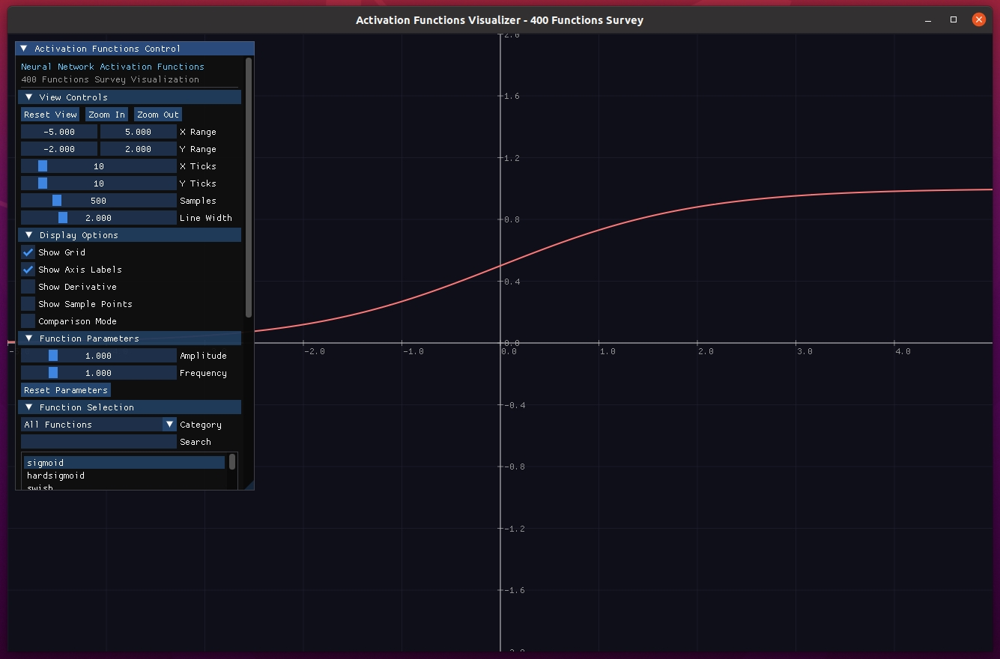

# AutoAlgorama — Neural Network Activation Functions Visualizer

> An interactive visualization tool for **real-time exploration and comparison of 80+ activation functions** used in neural networks. Based on the comprehensive survey paper: *"Three Decades of Activations: A Comprehensive Survey of 400 Activation Functions for Neural Networks"*.



---

## ✨ Features

### Visualization
- **Real-time Plotting**: Curves update instantly as you adjust parameters
- **Precise Readout**: Crosshair + floating tooltip showing `x`, `f(x)`, and `f'(x)` (derivative)
- **Derivative Visualization**: Toggle to display the derivative curve alongside the function
- **Multi-function Comparison**: Compare multiple activation functions simultaneously with color-coded legend

### Interaction
- **Mouse Wheel Zoom**: Zoom in/out centered on cursor position
- **Right-click Drag**: Pan the view
- **Hover Detection**: Highlight points on curves with exact coordinate display

### Control Panel
- **Category Filter**: Filter functions by category (Sigmoid, ReLU, Tanh, etc.)
- **Search**: Quickly find functions by name
- **Parameter Adjustment**: Modify amplitude and frequency in real-time
- **Display Options**: Toggle grid, axis labels, derivative, sample points
- **Function Info**: View formula and key values for selected function

### Extensibility
- **Easy to Add New Functions**: Register new activation functions with minimal code changes
- **Category System**: Organize functions into logical groups

---

## 📊 Supported Activation Functions (80+)

| Category | Functions |
|----------|-----------|
| **Sigmoid Family** | Sigmoid, HardSigmoid, Swish, HardSwish, ESwish, LogSigmoid, dSiLU, ParametricSwish |
| **Tanh Family** | Tanh, HardTanh, LeCunTanh, ScaledTanh, PenalizedTanh, TanhShrink, LiSHT |
| **ReLU Family** | ReLU, LeakyReLU, PReLU, ELU, SELU, CELU, GELU, GELUTanh, SoftPlus, Mish, ReLU6, ThresholdedReLU, SReLU, ISRU, ISRLU, SERLU, RReLU, SoLU |
| **Exponential** | ELiSH, HardELiSH, SoftExponential, LogSigmoid, Log1p, Hexpo |
| **Gaussian/Radial** | Gaussian, GaussianELU, GCU, Sine, Cosine, Sinc, Sech, DoubleGaussian |
| **Adaptive** | Softsign, BentIdentity, ArcTan, ArcSinh, Elliott, SQNL, APL |
| **Piecewise** | Identity, BinaryStep, Sign, AbsoluteValue, Maxout, SymmetricSaturating |
| **Smooth** | SmoothReLU, SmoothAbs, SoftShrink, HardShrink, SquarePlus, Smelu |
| **Special** | Probit, CLogLog, LogLog, BimodalSigmoid, BipolarSigmoid, Gompertz, SoftClipping |
| **Modern** | SiLU, Phish, NCU, DSU, Smish, Logish, TanhExp, Snake, PAU, FReLU, StarReLU, Serf, ACONC, MetaACON, Maxsig |
| **Attention/Transformer** | QuickGELU, GEGLU, ReGLU, SwiGLU, Laplace |
| **Polynomial** | Square, Cube, Quartic |
| **Probabilistic** | LogisticCDF, NormalCDF, CauchyCDF, GumbelCDF, WeibullLike |

---

## 🧰 Dependencies

- **Operating System**: Windows / macOS / Linux
- **Build Tools**: CMake ≥ 3.10, C++17 compatible compiler
- **Third-party Libraries**:
  - [Dear ImGui](https://github.com/ocornut/imgui) (UI framework, included in `external/`)
  - [SDL2](https://www.libsdl.org/) (Window/Input handling)
  - OpenGL (Graphics rendering)
  - [Eigen](https://eigen.tuxfamily.org/) (Matrix/numerical operations)

---

## 🚀 Quick Start

### Build

```bash
# Clone the repository
git clone https://github.com/user/auto_algorama.git
cd auto_algorama

# Build
mkdir -p build && cd build
cmake ..
make -j$(nproc)
```

### Run

```bash
./AutoAlgorama
```

---

## 🕹️ Usage Guide

### Control Panel
- **View Controls**: Reset view, zoom in/out, adjust X/Y range, tick count, sample count, line width
- **Display Options**: Toggle grid, axis labels, derivative curve, sample points, comparison mode
- **Function Parameters**: Adjust amplitude and frequency
- **Function Selection**: Filter by category, search, and select functions
- **Current Function Info**: View name, formula, and key values

### Canvas Interaction
| Action | Operation |
|--------|-----------|
| **Zoom** | Mouse wheel |
| **Pan** | Right-click + drag |
| **View Coordinates** | Hover over canvas |
| **View Exact Values** | Hover over curve |

### Comparison Mode
1. Check "Comparison Mode" in Display Options
2. Click multiple functions to add them to comparison
3. Each function displays in a different color with legend

---

## 🧪 Tips

- **Numerical Range**: Some functions saturate at extreme x values; adjust the X range accordingly
- **Sampling Density**: Increase samples for smoother curves (higher values may impact performance)
- **Derivative Display**: Enable "Show Derivative" to visualize the gradient of the function

---

## 🛠️ FAQ

**Q1: Black/empty window on startup?**
- Ensure your system supports OpenGL 3.0+
- Update graphics drivers
- Check terminal for GLFW/OpenGL initialization errors

**Q2: Build fails with missing SDL2/Eigen?**
- Install dependencies:
  ```bash
  # Ubuntu/Debian
  sudo apt-get install libsdl2-dev libeigen3-dev libgl1-mesa-dev
  
  # macOS
  brew install sdl2 eigen
  ```

**Q3: How to add a new activation function?**
1. Add the function implementation in `include/functions/activation_functions.h`
2. Register it in `src/windows/main_window.cpp` using `REGISTER_FUNCTION_WITH_CATEGORY`

---

## 📁 Project Structure

```
auto_algorama/
├── include/
│   ├── common/           # Common types and logging
│   ├── functions/        # Activation function definitions
│   │   ├── activation_functions.h  # 80+ activation functions
│   │   └── functions.h             # Function manager
│   └── windows/          # Window definitions
├── src/
│   └── windows/          # Main window implementation
├── exec/                 # Entry point
├── external/             # Third-party libraries (ImGui)
└── docs/                 # Documentation and screenshots
```

---

## 📄 License

This project is licensed under the terms specified in the [LICENSE](LICENSE) file.

---

## 🔗 References

- [Dear ImGui](https://github.com/ocornut/imgui)
- [SDL2](https://www.libsdl.org/)
- [Eigen](https://eigen.tuxfamily.org/)
- *"Three Decades of Activations: A Comprehensive Survey of 400 Activation Functions for Neural Networks"*
