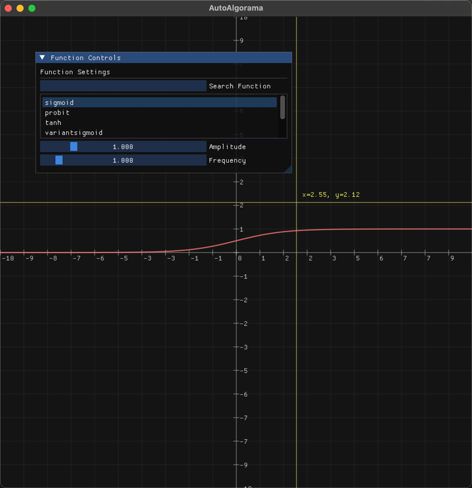

# AutoAlgorama — 激活函数可视化工具

> 一个交互式的小工具，用来**实时查看与比较各类激活/数学函数**的曲线与数值，便于在调参或教学时快速直觉化地理解函数行为。



---

## ✨ 功能特性

- **实时绘图**：拖动参数滑块，曲线即时更新
- **精确读数**：十字准线+悬浮提示，显示当前 `(x, y)`
- **参数面板**：支持搜索函数、设置“Amplitude/幅值”“Frequency/频率”等自定义参数
- **易扩展**：以最少改动新增一个函数并立即可视化

> 截图仅供示例，具体控件/命名以代码为准。

---

## 🧰 依赖与环境

- **操作系统**：Windows / macOS / Linux
- **编译工具**：CMake ≥ 3.10，C++11 或以上编译器
- **第三方库**（常见组合）：
  - [Dear ImGui](https://github.com/ocornut/imgui)（UI）
  - [GLFW](https://www.glfw.org/)（窗口/输入）
  - OpenGL（图形上下文）
  - Eigen（如需要做矩阵/数值运算）

---

## 🚀 快速开始

```bash
mkdir -p build
cd build
cmake ..
cmake --build . -j
```

运行可执行文件（名称以项目实际生成为准）：

```bash
./AutoAlgorama
```

---

## 🕹️ 使用指南

- 左上角 **Function Controls** 面板
  - **Search Function**：输入关键字筛选函数
  - **Amplitude / Frequency**：调整曲线幅值、频率（如函数支持）
- 画布交互
  - **滚轮**：缩放
  - **按住右键拖拽**：平移
  - **双击**：复位视图（如项目中有实现）
- 读数
  - 移动鼠标到曲线上，底部/浮窗显示当前 `x` 与 `y`

---

## 📚 已内置（或常见可选）的函数

> 实际内置以代码为准，这里列出常用激活函数，便于对照或扩展：

- Sigmoid / Tanh / ReLU / Leaky ReLU / PReLU
---

## 🧪 小贴士

- **数值范围**：某些函数在极大/极小 x 时会发生数值饱和，可适当限制 `x` 轴范围或做归一化
- **采样密度**：曲线锯齿通常与采样点数相关，增大采样可改善平滑度

---

## 🛠️ 常见问题（FAQ）

**Q1：运行后是黑屏/空白窗口？**
- 请确认系统支持 OpenGL，并更新显卡驱动
- 终端查看是否有 `GLFW`/`OpenGL` 初始化失败的日志

**Q2：构建失败，提示找不到 GLFW/ImGui？**
- 确认子模块是否初始化；或在系统中安装相应的开发包，并在 CMake 中启用 `find_package(GLFW3)` 等

---

## 📄 许可

本工具随项目仓库的 License

---

## 🔗 参考

- [Dear ImGui](https://github.com/ocornut/imgui) · [GLFW](https://www.glfw.org/)
